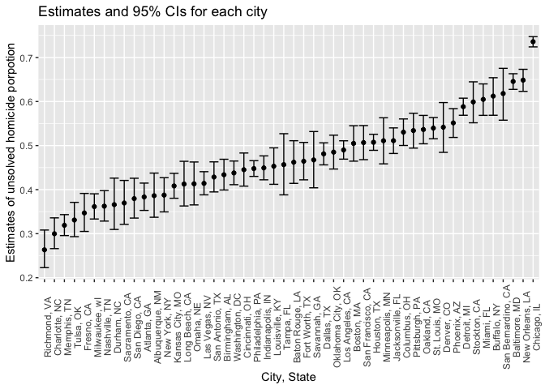
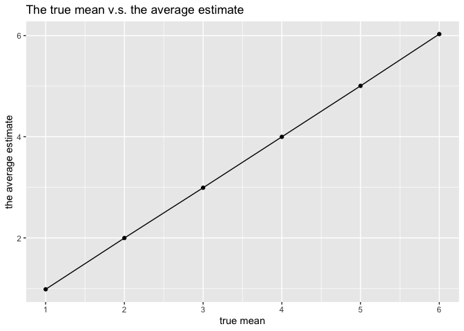
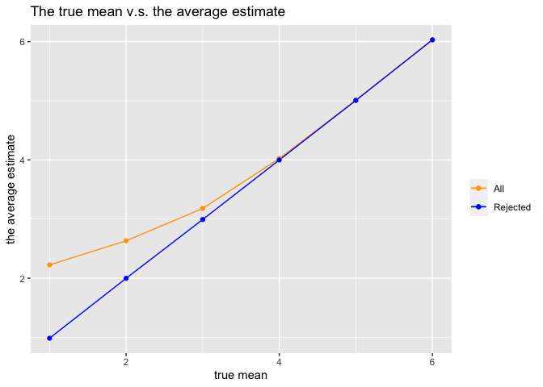

P8105_hw5_qx2222
================
Qiaoyi Xu
2022-11-15

``` r
library(tidyverse)
```

    ## ── Attaching packages ─────────────────────────────────────── tidyverse 1.3.2 ──
    ## ✔ ggplot2 3.3.6      ✔ purrr   0.3.4 
    ## ✔ tibble  3.1.8      ✔ dplyr   1.0.10
    ## ✔ tidyr   1.2.0      ✔ stringr 1.4.1 
    ## ✔ readr   2.1.2      ✔ forcats 0.5.2 
    ## ── Conflicts ────────────────────────────────────────── tidyverse_conflicts() ──
    ## ✖ dplyr::filter() masks stats::filter()
    ## ✖ dplyr::lag()    masks stats::lag()

``` r
set.seed(1)
```

## Problem 1 (answer posted)

The code chunk below imports the data in individual spreadsheets
contained in `./data/zip_data/`. To do this, I create a dataframe that
includes the list of all files in that directory and the complete path
to each file. As a next step, I `map` over paths and import data using
the `read_csv` function. Finally, I `unnest` the result of `map`.

``` r
full_df = 
  tibble(
    files = list.files("data/problem1_data/"),
    path = str_c("data/problem1_data/", files)
  ) %>% 
  mutate(data = map(path, read_csv)) %>% 
  unnest()
```

The result of the previous code chunk isn’t tidy – data are wide rather
than long, and some important variables are included as parts of others.
The code chunk below tides the data using string manipulations on the
file, converting from wide to long, and selecting relevant variables.

``` r
tidy_df = 
  full_df %>% 
  mutate(
    files = str_replace(files, ".csv", ""),
    group = str_sub(files, 1, 3)) %>% 
  pivot_longer(
    week_1:week_8,
    names_to = "week",
    values_to = "outcome",
    names_prefix = "week_") %>% 
  mutate(week = as.numeric(week)) %>% 
  select(group, subj = files, week, outcome)
```

Finally, the code chunk below creates a plot showing individual data,
faceted by group.

``` r
tidy_df %>% 
  ggplot(aes(x = week, y = outcome, group = subj, color = group)) + 
  geom_point() + 
  geom_path() + 
  facet_grid(~group)
```

<!-- -->

This plot suggests high within-subject correlation – subjects who start
above average end up above average, and those that start below average
end up below average. Subjects in the control group generally don’t
change over time, but those in the experiment group increase their
outcome in a roughly linear way.

## Problem 2

### Import homicide data

``` r
homicide = read_csv("data/homicide-data.csv") #import 'homicide' data
```

    ## Rows: 52179 Columns: 12
    ## ── Column specification ────────────────────────────────────────────────────────
    ## Delimiter: ","
    ## chr (9): uid, victim_last, victim_first, victim_race, victim_age, victim_sex...
    ## dbl (3): reported_date, lat, lon
    ## 
    ## ℹ Use `spec()` to retrieve the full column specification for this data.
    ## ℹ Specify the column types or set `show_col_types = FALSE` to quiet this message.

### Describe the raw data:

In the raw homicide data, there are 52179 observations and 12
variables,such as uid, reported_date, victim_last, victim_first,
victim_race, victim_age, victim_sex, city, state, lat, lon, disposition.
This dataset describe data on more than 52,000 criminal homicides over
the past decade in 50 of the largest American cities.

### Create new variables

``` r
homicide = homicide %>%
  mutate(city_state = str_c(city, ", ", state)) %>%
  filter(city_state!="Tulsa, AL") %>% #clear error data: Tulsa is not located in AL
  mutate(homicide_status = if_else(disposition == "Closed without arrest", "unsolved",
                                   if_else(disposition == "Open/No arrest", "unsolved",
                                           if_else(disposition == "Closed by arrest", "solved", NA_character_))))


homicide
```

    ## # A tibble: 52,178 × 14
    ##    uid   repor…¹ victi…² victi…³ victi…⁴ victi…⁵ victi…⁶ city  state   lat   lon
    ##    <chr>   <dbl> <chr>   <chr>   <chr>   <chr>   <chr>   <chr> <chr> <dbl> <dbl>
    ##  1 Alb-…  2.01e7 GARCIA  JUAN    Hispan… 78      Male    Albu… NM     35.1 -107.
    ##  2 Alb-…  2.01e7 MONTOYA CAMERON Hispan… 17      Male    Albu… NM     35.1 -107.
    ##  3 Alb-…  2.01e7 SATTER… VIVIANA White   15      Female  Albu… NM     35.1 -107.
    ##  4 Alb-…  2.01e7 MENDIO… CARLOS  Hispan… 32      Male    Albu… NM     35.1 -107.
    ##  5 Alb-…  2.01e7 MULA    VIVIAN  White   72      Female  Albu… NM     35.1 -107.
    ##  6 Alb-…  2.01e7 BOOK    GERALD… White   91      Female  Albu… NM     35.2 -107.
    ##  7 Alb-…  2.01e7 MALDON… DAVID   Hispan… 52      Male    Albu… NM     35.1 -107.
    ##  8 Alb-…  2.01e7 MALDON… CONNIE  Hispan… 52      Female  Albu… NM     35.1 -107.
    ##  9 Alb-…  2.01e7 MARTIN… GUSTAVO White   56      Male    Albu… NM     35.1 -107.
    ## 10 Alb-…  2.01e7 HERRERA ISRAEL  Hispan… 43      Male    Albu… NM     35.1 -107.
    ## # … with 52,168 more rows, 3 more variables: disposition <chr>,
    ## #   city_state <chr>, homicide_status <chr>, and abbreviated variable names
    ## #   ¹​reported_date, ²​victim_last, ³​victim_first, ⁴​victim_race, ⁵​victim_age,
    ## #   ⁶​victim_sex

\###Summarized table

``` r
homicide_table = homicide %>%
  group_by(city_state) %>%
  summarise(total_homicide = n(),
            number_unsolved = sum(homicide_status == "unsolved")) %>%
  knitr::kable(col.names = c("City, State", "Total number of homicide", "Number of unsolved homicide"))

homicide_table
```

| City, State        | Total number of homicide | Number of unsolved homicide |
|:-------------------|-------------------------:|----------------------------:|
| Albuquerque, NM    |                      378 |                         146 |
| Atlanta, GA        |                      973 |                         373 |
| Baltimore, MD      |                     2827 |                        1825 |
| Baton Rouge, LA    |                      424 |                         196 |
| Birmingham, AL     |                      800 |                         347 |
| Boston, MA         |                      614 |                         310 |
| Buffalo, NY        |                      521 |                         319 |
| Charlotte, NC      |                      687 |                         206 |
| Chicago, IL        |                     5535 |                        4073 |
| Cincinnati, OH     |                      694 |                         309 |
| Columbus, OH       |                     1084 |                         575 |
| Dallas, TX         |                     1567 |                         754 |
| Denver, CO         |                      312 |                         169 |
| Detroit, MI        |                     2519 |                        1482 |
| Durham, NC         |                      276 |                         101 |
| Fort Worth, TX     |                      549 |                         255 |
| Fresno, CA         |                      487 |                         169 |
| Houston, TX        |                     2942 |                        1493 |
| Indianapolis, IN   |                     1322 |                         594 |
| Jacksonville, FL   |                     1168 |                         597 |
| Kansas City, MO    |                     1190 |                         486 |
| Las Vegas, NV      |                     1381 |                         572 |
| Long Beach, CA     |                      378 |                         156 |
| Los Angeles, CA    |                     2257 |                        1106 |
| Louisville, KY     |                      576 |                         261 |
| Memphis, TN        |                     1514 |                         483 |
| Miami, FL          |                      744 |                         450 |
| Milwaukee, wI      |                     1115 |                         403 |
| Minneapolis, MN    |                      366 |                         187 |
| Nashville, TN      |                      767 |                         278 |
| New Orleans, LA    |                     1434 |                         930 |
| New York, NY       |                      627 |                         243 |
| Oakland, CA        |                      947 |                         508 |
| Oklahoma City, OK  |                      672 |                         326 |
| Omaha, NE          |                      409 |                         169 |
| Philadelphia, PA   |                     3037 |                        1360 |
| Phoenix, AZ        |                      914 |                         504 |
| Pittsburgh, PA     |                      631 |                         337 |
| Richmond, VA       |                      429 |                         113 |
| Sacramento, CA     |                      376 |                         139 |
| San Antonio, TX    |                      833 |                         357 |
| San Bernardino, CA |                      275 |                         170 |
| San Diego, CA      |                      461 |                         175 |
| San Francisco, CA  |                      663 |                         336 |
| Savannah, GA       |                      246 |                         115 |
| St. Louis, MO      |                     1677 |                         905 |
| Stockton, CA       |                      444 |                         266 |
| Tampa, FL          |                      208 |                          95 |
| Tulsa, OK          |                      583 |                         193 |
| Washington, DC     |                     1345 |                         589 |

### For the city of Baltimore, MD

``` r
Balto = homicide %>%
  filter(city_state == "Baltimore, MD") %>%
  summarise(total_homicide = n(),
            number_unsolved = sum(homicide_status == "unsolved"))

Balto_prop <- 
  prop.test(Balto %>% pull(number_unsolved), Balto %>% pull(total_homicide))

Balto_prop %>% broom::tidy() %>%
  knitr::kable()
```

|  estimate | statistic | p.value | parameter |  conf.low | conf.high | method                                               | alternative |
|----------:|----------:|--------:|----------:|----------:|----------:|:-----------------------------------------------------|:------------|
| 0.6455607 |   239.011 |       0 |         1 | 0.6275625 | 0.6631599 | 1-sample proportions test with continuity correction | two.sided   |

### For each of the cities

``` r
proptest_function = function(df) {
  summary = df %>% 
    summarise(total_homicide = n(),
              number_unsolved = sum(homicide_status == "unsolved"))
              
  cities_proptest = prop.test(summary %>% pull(number_unsolved), 
                              summary %>% pull(total_homicide)) %>%
    broom::tidy()
  
  cities_proptest
}


cities_final = homicide %>%
  nest(data = -city_state) %>%
  mutate(cities_test = map(data, proptest_function)) %>%
  unnest(cities_test) %>%
  select(city_state,estimate,starts_with('conf'))

cities_final %>%
  knitr::kable(col.names = c("City, State", "estimate","confidenceinterval_low","confidenceinterval_high"))
```

| City, State        |  estimate | confidenceinterval_low | confidenceinterval_high |
|:-------------------|----------:|-----------------------:|------------------------:|
| Albuquerque, NM    | 0.3862434 |              0.3372604 |               0.4375766 |
| Atlanta, GA        | 0.3833505 |              0.3528119 |               0.4148219 |
| Baltimore, MD      | 0.6455607 |              0.6275625 |               0.6631599 |
| Baton Rouge, LA    | 0.4622642 |              0.4141987 |               0.5110240 |
| Birmingham, AL     | 0.4337500 |              0.3991889 |               0.4689557 |
| Boston, MA         | 0.5048860 |              0.4646219 |               0.5450881 |
| Buffalo, NY        | 0.6122841 |              0.5687990 |               0.6540879 |
| Charlotte, NC      | 0.2998544 |              0.2660820 |               0.3358999 |
| Chicago, IL        | 0.7358627 |              0.7239959 |               0.7473998 |
| Cincinnati, OH     | 0.4452450 |              0.4079606 |               0.4831439 |
| Columbus, OH       | 0.5304428 |              0.5002167 |               0.5604506 |
| Dallas, TX         | 0.4811742 |              0.4561942 |               0.5062475 |
| Denver, CO         | 0.5416667 |              0.4846098 |               0.5976807 |
| Detroit, MI        | 0.5883287 |              0.5687903 |               0.6075953 |
| Durham, NC         | 0.3659420 |              0.3095874 |               0.4260936 |
| Fort Worth, TX     | 0.4644809 |              0.4222542 |               0.5072119 |
| Fresno, CA         | 0.3470226 |              0.3051013 |               0.3913963 |
| Houston, TX        | 0.5074779 |              0.4892447 |               0.5256914 |
| Indianapolis, IN   | 0.4493192 |              0.4223156 |               0.4766207 |
| Jacksonville, FL   | 0.5111301 |              0.4820460 |               0.5401402 |
| Kansas City, MO    | 0.4084034 |              0.3803996 |               0.4370054 |
| Las Vegas, NV      | 0.4141926 |              0.3881284 |               0.4407395 |
| Long Beach, CA     | 0.4126984 |              0.3629026 |               0.4642973 |
| Los Angeles, CA    | 0.4900310 |              0.4692208 |               0.5108754 |
| Louisville, KY     | 0.4531250 |              0.4120609 |               0.4948235 |
| Memphis, TN        | 0.3190225 |              0.2957047 |               0.3432691 |
| Miami, FL          | 0.6048387 |              0.5685783 |               0.6400015 |
| Milwaukee, wI      | 0.3614350 |              0.3333172 |               0.3905194 |
| Minneapolis, MN    | 0.5109290 |              0.4585150 |               0.5631099 |
| Nashville, TN      | 0.3624511 |              0.3285592 |               0.3977401 |
| New Orleans, LA    | 0.6485356 |              0.6231048 |               0.6731615 |
| New York, NY       | 0.3875598 |              0.3494421 |               0.4270755 |
| Oakland, CA        | 0.5364308 |              0.5040588 |               0.5685037 |
| Oklahoma City, OK  | 0.4851190 |              0.4467861 |               0.5236245 |
| Omaha, NE          | 0.4132029 |              0.3653146 |               0.4627477 |
| Philadelphia, PA   | 0.4478103 |              0.4300380 |               0.4657157 |
| Phoenix, AZ        | 0.5514223 |              0.5184825 |               0.5839244 |
| Pittsburgh, PA     | 0.5340729 |              0.4942706 |               0.5734545 |
| Richmond, VA       | 0.2634033 |              0.2228571 |               0.3082658 |
| San Antonio, TX    | 0.4285714 |              0.3947772 |               0.4630331 |
| Sacramento, CA     | 0.3696809 |              0.3211559 |               0.4209131 |
| Savannah, GA       | 0.4674797 |              0.4041252 |               0.5318665 |
| San Bernardino, CA | 0.6181818 |              0.5576628 |               0.6753422 |
| San Diego, CA      | 0.3796095 |              0.3354259 |               0.4258315 |
| San Francisco, CA  | 0.5067873 |              0.4680516 |               0.5454433 |
| St. Louis, MO      | 0.5396541 |              0.5154369 |               0.5636879 |
| Stockton, CA       | 0.5990991 |              0.5517145 |               0.6447418 |
| Tampa, FL          | 0.4567308 |              0.3881009 |               0.5269851 |
| Tulsa, OK          | 0.3310463 |              0.2932349 |               0.3711192 |
| Washington, DC     | 0.4379182 |              0.4112495 |               0.4649455 |

### Create plot

``` r
plot_cities = cities_final %>%
  mutate(city_state = fct_reorder(city_state, estimate)) %>%
  ggplot(aes (x = city_state, y = estimate)) +
  geom_point()+
  geom_errorbar(aes(ymin = conf.low, ymax = conf.high))+
  theme(axis.text.x = element_text(angle = 90))+
  labs(x = "City, State", y = "Estimates of unsolved homicide porpotion",
       title = "Estimates and 95% CIs for each city")

plot_cities #shows the estimates and 95% CIs for each city
```

<!-- -->

``` r
ggsave(
  filename = "results/plot for each city.pdf",
  plot = plot_cities,
  width = 30,
  height = 20,
  units = "cm"
  ) #export plot to 'results' directory
```

This plot shows the estimates and CIs for each city and organize cities
according to the proportion of unsolved homicides.

## Problem 3

### First set the following design elements:

Fix n=30 Fix σ=5 Set μ=0.

``` r
#write t-test function
ttest_function = function(n = 30, sd = 5, mu = 0) {
  sample = rnorm(n = n, sd = sd, mean = mu)
  result = t.test(sample) %>%
  broom::tidy()%>%
  select(estimate, p.value)
  
  result
}
```

### Generate 5000 datasets from the model

``` r
prob3_df = 
  expand.grid(mean = 0, iteration = 1:5000) %>%
  mutate(result = map(.x = mean, ~ttest_function(mu=.x))) %>%
  unnest(result) %>%
  knitr::kable()
```

### Repeat the above for μ={1,2,3,4,5,6}

``` r
prob3_diffmean = 
  expand.grid(mean = 1:6, iteration = 1:5000) %>%
  mutate(result = map(.x = mean, ~ttest_function(mu=.x))) %>%
  unnest(result) 
```

### Make a plot(true mean v.s. proportion of times the null was rejected)

``` r
mean_prop_plot = prob3_diffmean %>%
  group_by(mean) %>%
  summarize(prop_reject = sum(p.value<0.05) / 5000) %>%
  ggplot(aes(x = mean, y = prop_reject)) +
  geom_point()+
  geom_path() +
  scale_x_continuous(breaks = 1:6)+
  labs(x = "true mean", y = "proportion of times the null was rejected",
       title = " The true mean v.s. The power of the test")

mean_prop_plot
```

<!-- -->

``` r
ggsave(
  filename = "results/mean v.s. rejected porportion.pdf",
  plot = mean_prop_plot,
  width = 30,
  height = 20,
  units = "cm"
  ) #export plot to 'results' directory
```

### Describe the association between effect size and power:

From the plot in output, we could see there is a increasing trend
between the proportion of times the null was rejected and the true mean.
Thus, there is a postive relationship between power and effect size.
When the effect size increases, the power increases.

### Make a plot showing the average estimate of μ̂ on the y axis and the true value of μ on the x axis

``` r
mean_estimate_plot = prob3_diffmean %>%
  group_by(mean) %>%
  summarize(average_estimate = mean(estimate)) %>%
  ggplot(aes(x = mean, y = average_estimate)) +
  geom_point()+
  geom_path() +
  scale_x_continuous(breaks = 1:6)+
  labs(x = "true mean", y = "the average estimate",
       title = "the true mean v.s. the average estimate")

mean_estimate_plot
```

<!-- -->

``` r
ggsave(
  filename = "results/mean v.s. average estimate.pdf",
  plot = mean_estimate_plot,
  width = 30,
  height = 20,
  units = "cm"
  ) #export plot to 'results' directory
```

### make a second plot (the average estimate of μ̂ only in samples for which the null was rejected on the y axis and the true value of μ on the x axis)

``` r
rejected = prob3_diffmean %>%
  filter(p.value <= 0.05) %>%
  group_by(mean) %>%
  summarise(average_estimate = mean(estimate))

all_estimates = prob3_diffmean %>%
  group_by(mean) %>%
  summarise(average_estimate = mean(estimate))

overlay_plot = ggplot(all_estimates, aes(x = mean, y = average_estimate)) +
  geom_line(data = rejected, aes(color = "orange"))+
  geom_line(data = all_estimates, aes(color = "blue"))+
  geom_point(data = rejected, aes(color = "orange"))+
  geom_point(data = all_estimates, aes(color = "blue"))+
  scale_colour_manual(name = "",
                      values = c("orange" ="orange", "blue" = "blue"),
                      labels = c("All", "Rejected"))+
  labs(x = "true mean", y = "the average estimate",
       title = "the true mean v.s. the average estimate")
  
overlay_plot 
```

<!-- -->

``` r
ggsave(
  filename = "results/the overlay plot.pdf",
  plot = overlay_plot,
  width = 30,
  height = 20,
  units = "cm"
  ) #export plot to 'results' directory
```

### Answer questions:

Is the sample average of μ̂ across tests for which the null is rejected
approximately equal to the true value of μ? Why or why not?

From the final overlay plot, we could conclude the sample average of μ̂
across tests for which the null is not approximately equal to the true
value of μ. When the true mean is smaller than 4, the sample average
estimates are very different with the true value. But then the true mean
is between 4 and 6, the sample average estimates are more and more close
to the true value. Because, when the effect size is small and the power
is low, which makes fewer rejected samples and lower reject proportion.
Thus, the average estimates are far away with the true value. On the
contrary, when the effect size is big and the power is high, which makes
more rejected samples and higher reject proportion. Thus, the average
estimates are close to the true value.
